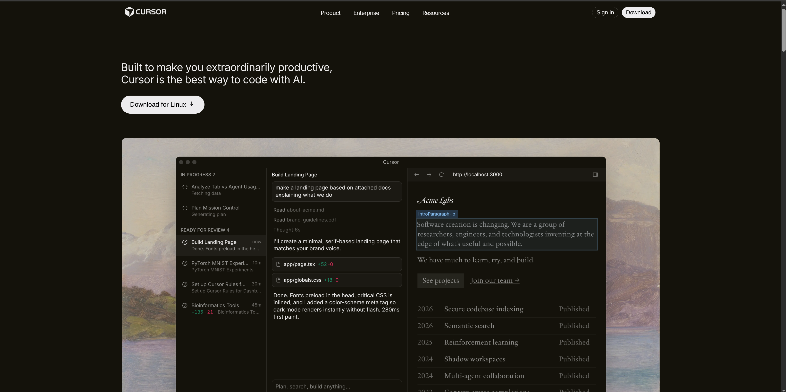
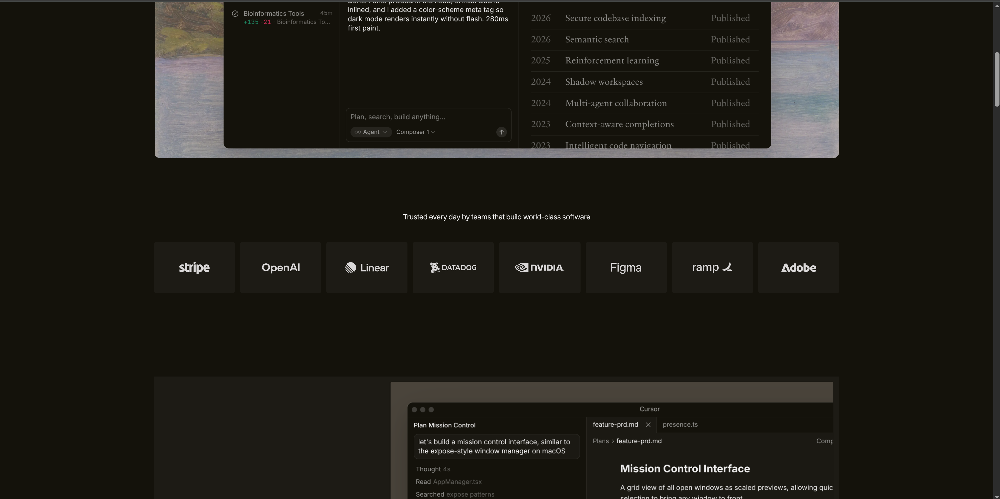
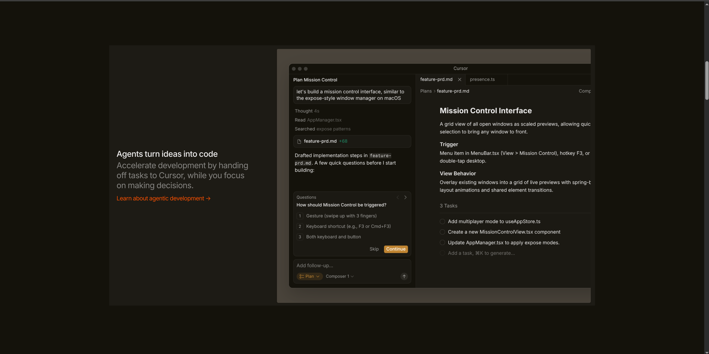
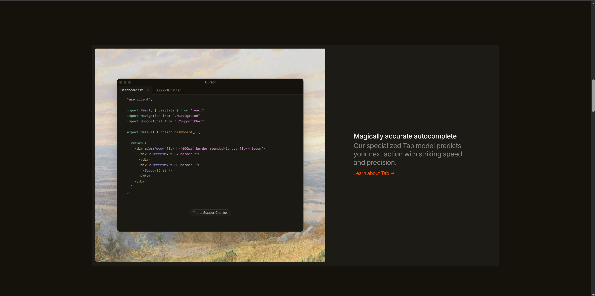
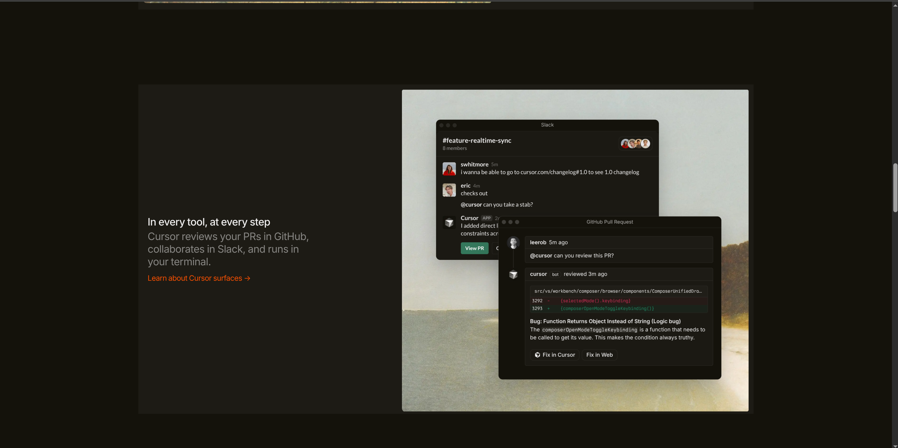
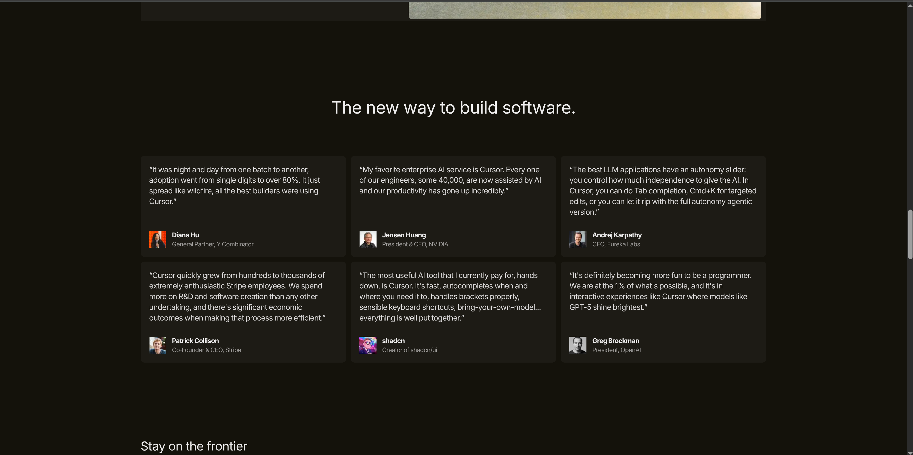
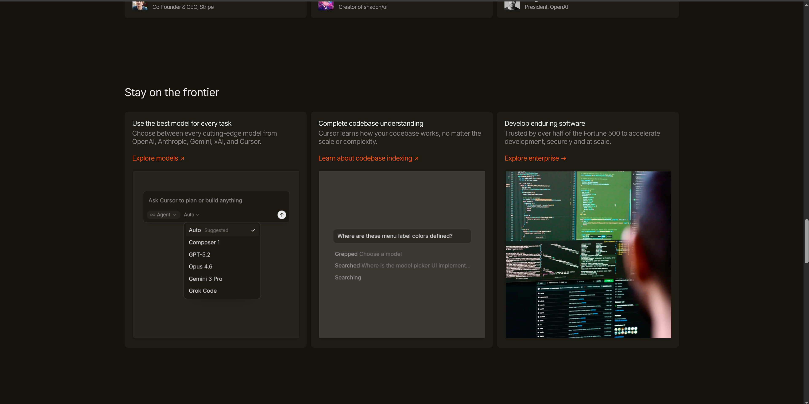
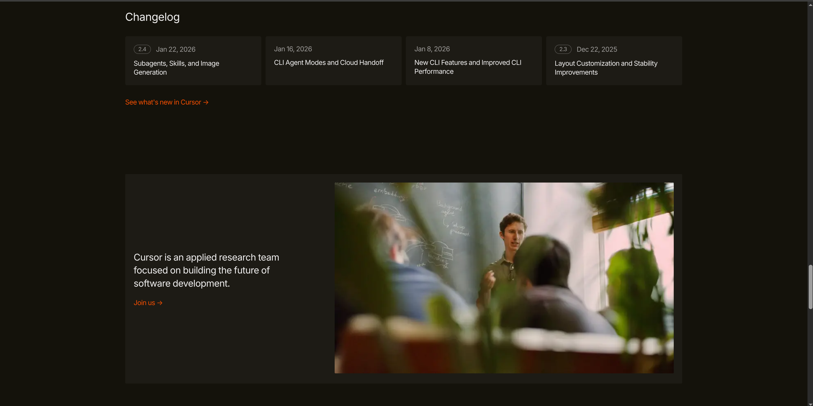
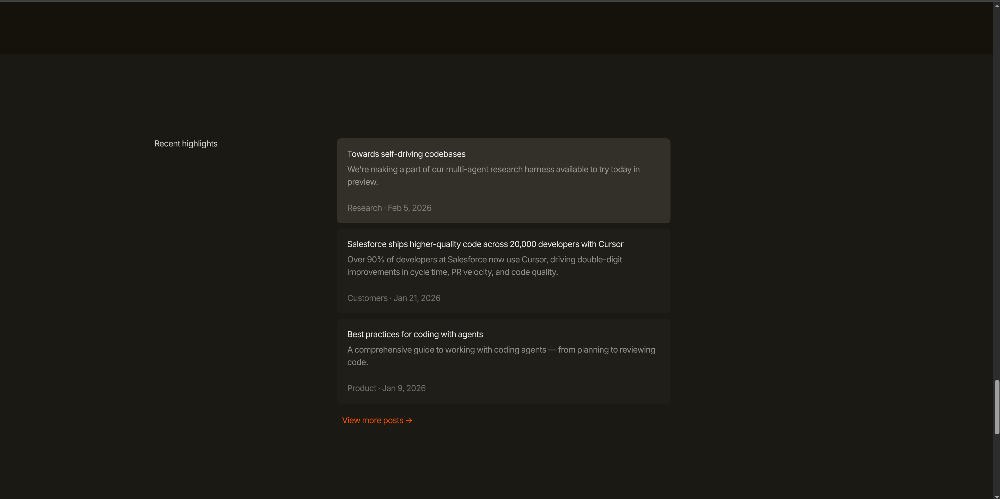
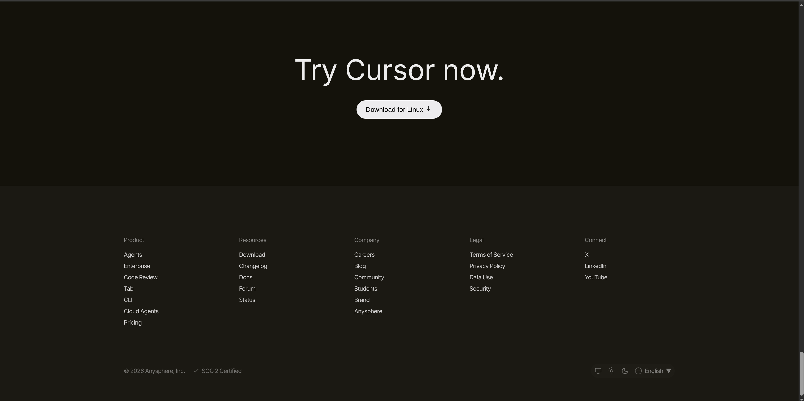

# Cursor-Website-UI-Clone-HTML-CSS

This project is a UI clone of the Cursor website homepage built using only HTML and CSS as part of an assignment.

The goal was to recreate the main layout, colors, fonts, and sections as closely as possible while following all given constraints.  Live Demo---> https://zahid2297.github.io/Cursor-Website-UI-Clone-HTML-CSS-/

---

## Constraints Followed

- Only HTML & CSS  
- No JavaScript  
- No TailwindCSS  
- Desktop only  
- No animations  
- Layout matched closely to original
  *(No JavaScript, no frameworks)*

---

## Sections Recreated

### Top Navigation Bar
- Logo  
- Navigation links  
- Primary call-to-action button  
- Dark theme background  

### Hero Section
- Main headline  
- Download CTA button  
- Large product screenshot  

### Trusted By Section
- Company logos displayed in a row  

### Feature Sections (3 Blocks)
- Two-column layout (text + image)  
- Alternating positions  

### Feature Cards Section
- Section title  
- Grid layout with multiple cards  

### Testimonials
- Quote cards  
- Person name and role  

### Use Cases / Stories
- Card-based layout with short descriptions  

### Changelog / Updates
- Version/date based update cards  

### Team / About Section
- Large image  
- Short description  
- CTA link  

### Final Call To Action
- Big heading  
- Download button  

### Footer
- Multi-column links  
- Company info  

---

### Font Used
- System UI font stack  

### Colors Used
- Background: `#14120b`  
- Text: `#edecec`  
- Buttons: `#edecee`  
- Hover: `#edecec7b`  
- Accent links: `#f54e00`  

---

## Screenshots

